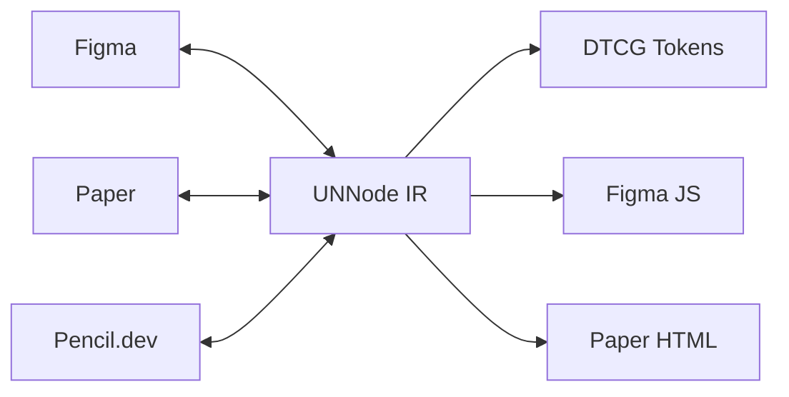
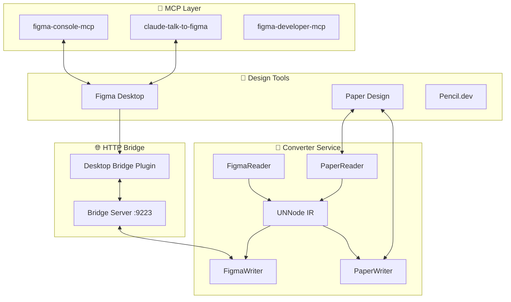

<div align="center">

# DesignDev

**Universal Design Converter & MCP Gateway**

*Seamlessly convert designs between Figma, Paper, and Pencil.dev with AI-powered workflows*

[](./CHANGELOG.md)
[](./LICENSE)
[](https://python.org/)
[](https://www.typescriptlang.org/)

[](https://github.com/willbnu/design-converter/stargazers)
[](https://github.com/willbnu/design-converter/network/members)

---

[**🚀 Quick Start**](#-quick-start) • [**📚 Documentation**](#-documentation) • [**🛠️ Architecture**](#%EF%B8%8F-architecture) • [**🔌 MCP Servers**](#-mcp-servers)

</div>

---

## Why DesignDev?

Design tool fragmentation costs teams countless hours. You need:

| Challenge | DesignDev Solution |
|-----------|-------------------|
| 🔴 **Tool silos** | Universal IR converts between Figma ↔ Paper ↔ Pencil |
| 🔴 **Manual copy-paste** | Automated MCP/CLI workflows |
| 🔴 **Lost design tokens** | W3C DTCG token extraction |
| 🔴 **No AI integration** | MCP servers for Claude/Cursor/ Windsurf |
| 🔴 **Plugin complexity** | Simple HTTP bridge + WebSocket |

### What You Get

```
✅ Universal Design Converter (Python)
✅ 3 Figma MCP Servers (56+ tools)
✅ HTTP Bridge Server for programmatic access
✅ Paper MCP Integration (read/write)
✅ Pencil.dev MCP Integration (read/write)
✅ DTCG Token Extraction
✅ CLI Tools for automation
✅ React Dashboard for monitoring
```

---

## ✨ Features

<table>
<tr>
<td width="50%">

### 🔄 Universal Converter
- Figma → Paper → Pencil.dev
- Intermediate Representation (IR)
- Rich text with style runs
- Design tokens (DTCG 2025)
- Variable bindings

</td>
<td width="50%">

### 🔌 MCP Gateway
- **figma-console** — 56+ tools, full CRUD
- **claude-talk-to-figma** — Claude-optimized
- **figma-developer** — Framelink popular
- WebSocket + HTTP protocols
- Multi-instance support

</td>
</tr>
<tr>
<td width="50%">

### 🖥️ CLI Tools
- `design-convert` — Convert designs
- `figma-tokens` — Extract tokens
- `figma-bridge-server` — HTTP bridge
- Batch operations support
- JSON output for scripting

</td>
<td width="50%">

### 🎨 Plugins
- **Desktop Bridge** — WebSocket to Figma
- **AI Designer** — AI-powered design
- Auto-discovery (ports 9223-9232)
- Real-time sync

</td>
</tr>
</table>

---

## 🚀 Quick Start

### Installation

```bash
# Clone the repo
git clone https://github.com/willbnu/design-converter.git
cd design-converter

# Install Python dependencies
cd services/design-converter
pip install -r requirements.txt
```

### Convert Paper → Figma

```bash
# Start the bridge server
python adapters/figma/bridge_server.py --port 9223 &

# Convert Paper design to Figma JS
python converter.py --source paper:TO-0 --dest figma --output design.js

# Execute in Figma (requires Desktop Bridge plugin)
python execute_design.py design.js
```

### Use with Claude/Cursor

Add to your MCP config:

```json
{
  "mcpServers": {
    "figma-console": {
      "command": "npx",
      "args": ["-y", "southleft/figma-console-mcp"],
      "env": { "FIGMA_API_KEY": "your-key" }
    }
  }
}
```

---

## 🗺️ Platform Matrix

| Platform | Read | Write | Protocol | Port |
|----------|------|-------|----------|------|
| **Figma** | ✅ REST API | ✅ HTTP Bridge | WebSocket | 9223 |
| **Paper** | ✅ MCP | ✅ MCP | HTTP SSE | 29979 |
| **Pencil** | ✅ MCP | ✅ MCP | HTTP REST | 19000 |

### Conversion Routes



---

## 🏗️ Architecture



---

## 📁 Project Structure

```
DesignDev/
├── services/
│   └── design-converter/        # 🔄 Universal converter service
│       ├── ir/                   # Intermediate Representation
│       │   └── nodes.py          # UNNode dataclass + enums
│       ├── adapters/
│       │   ├── figma/            # Figma reader/writer/client
│       │   ├── paper/            # Paper MCP client/reader/writer
│       │   └── pencil/           # Pencil MCP client/reader/writer
│       ├── utils/                # Color, CSS, SVG, tokens
│       ├── converter.py          # Main orchestrator + CLI
│       └── execute_design.py     # Execute JS in Figma
│
├── mcps/                         # 🔌 MCP Server configurations
│   ├── figma-console/            # 56+ tools, full CRUD
│   ├── claude-talk-to-figma/     # Claude-optimized
│   └── mcp-config.json           # Unified config
│
├── plugins/                      # 🎨 Figma plugins
│   ├── desktop-bridge/           # WebSocket bridge plugin
│   └── ai-designer/              # AI-powered design
│
├── cli/bin/                      # 🖥️ CLI tools
│   ├── design-convert.sh         # Convert designs
│   ├── figma-tokens.sh           # Extract tokens
│   └── figma-bridge-server       # Start HTTP bridge
│
├── dashboards/                   # 📊 Monitoring dashboards
│   ├── figma-tools.html          # Main dashboard
│   └── app/                      # React + Vite app
│
└── docs/                         # 📚 Documentation
    └── knowledge/                # LLM context guides
```

---

## 🔌 MCP Servers

### figma-console-mcp (Recommended)

Full CRUD access via Desktop Bridge WebSocket plugin.

| Feature | Details |
|---------|---------|
| **Tools** | 56+ tools |
| **Mode** | Local (NPX) or Remote (SSE) |
| **Auth** | Figma PAT |
| **Protocol** | WebSocket :9223 + CDP fallback |

```bash
npx -y southleft/figma-console-mcp
```

### claude-talk-to-figma-mcp

Claude-optimized with accessibility features.

| Feature | Details |
|---------|---------|
| **Tools** | 35+ tools |
| **Focus** | Accessibility audits, bulk updates |
| **Special** | No Dev Mode required |

```bash
npx -y arinspunk/claude-talk-to-figma-mcp
```

### figma-developer-mcp (Framelink)

Popular npm package, Dev Mode focused.

| Feature | Details |
|---------|---------|
| **Focus** | Code generation |
| **Integration** | Code Connect |
| **Auth** | Figma PAT |

```bash
npx -y figma-developer-mcp
```

---

## 🛠️ Tech Stack

### Core

| Layer | Technology |
|-------|-----------|
| **IR** | Python dataclasses |
| **MCP Protocol** | JSON-RPC over stdio/SSE |
| **Figma API** | REST + Plugin API |
| **Paper MCP** | HTTP SSE JSON-RPC |
| **Pencil MCP** | HTTP REST |

### Plugins

| Plugin | Stack |
|--------|-------|
| **Desktop Bridge** | Vanilla JS + WebSocket |
| **AI Designer** | TypeScript + Preact + Vite + Tailwind |

### Dashboard

| Layer | Technology |
|-------|-----------|
| **Frontend** | React 18 + Vite 6 |
| **Styling** | Tailwind CSS + Geist fonts |
| **Routing** | TanStack Router |

---

## 📚 Documentation

### Essential Guides

| Guide | Description |
|-------|-------------|
| [**CHANGELOG**](./CHANGELOG.md) | Version history |
| [**CLAUDE.md**](./CLAUDE.md) | Claude Code instructions |
| [**AGENTS.md**](./AGENTS.md) | Agent workflows |

### Design Converter Docs

| Doc | Description |
|-----|-------------|
| [**ANALYSIS_REPORT.md**](./services/design-converter/docs/ANALYSIS_REPORT.md) | Full analysis |
| [**UNIVERSAL_PLUG.md**](./services/design-converter/docs/UNIVERSAL_PLUG.md) | HTTP bridge guide |

---

## 🔄 UNNode Intermediate Representation

The core of the converter is the UNNode IR:

```python
@dataclass
class UNNode:
    id: str
    name: str
    type: NodeType              # FRAME, TEXT, RECTANGLE, etc.
    x: float
    y: float
    width: UNSize
    height: UNSize
    fills: List[UNSolidFill | UNGradientFill | UNImageFill]
    strokes: List[UNStroke]
    effects: List[UNDropShadow | UNBlur]
    layout: Optional[UNLayout]  # Auto-layout
    text_style: Optional[UNTextStyle]
    children: List['UNNode']
    variable_bindings: Dict[str, UNVariableBinding]
```

### Supported Conversions

| From | To | Status |
|------|-----|--------|
| Figma | UNNode | ✅ Complete |
| UNNode | Figma JS | ✅ Complete |
| Paper | UNNode | ✅ Complete |
| UNNode | Paper | ✅ Complete |
| Pencil | UNNode | ✅ Complete |
| UNNode | Pencil | ✅ Complete |

---

## 🎯 Token Extraction

Extract W3C DTCG 2025.10 compliant design tokens:

```bash
# Extract tokens from Figma file
python converter.py --source figma:ABC123 --export-tokens tokens.json

# Output format
{
  "color": {
    "primary": {
      "$type": "color",
      "$value": "#0066CC"
    }
  },
  "typography": {
    "heading": {
      "$type": "typography",
      "$value": {
        "fontFamily": "Inter",
        "fontSize": "24px",
        "fontWeight": 700
      }
    }
  }
}
```

---

## 🔒 Security

| Feature | Implementation |
|---------|----------------|
| **API Keys** | Environment variables only |
| **WebSocket** | Localhost only (127.0.0.1) |
| **Plugin Auth** | Figma Plugin API sandbox |
| **No Cloud** | All processing local |

---

## 🤝 Contributing

Contributions welcome! Please read:

- [Contributing Guidelines](./CONTRIBUTING.md)
- [Code of Conduct](./CODE_OF_CONDUCT.md)

### Development Setup

```bash
# Clone and setup
git clone https://github.com/willbnu/design-converter.git
cd design-converter/services/design-converter

# Create venv
python -m venv .venv
source .venv/bin/activate
pip install -r requirements.txt

# Run tests
pytest tests/ -v
```

---

## 📄 License

This project is licensed under the MIT License.

```
Copyright (c) 2025-2026 William Finger

Permission is hereby granted, free of charge, to any person obtaining a copy
of this software and associated documentation files (the "Software"), to deal
in the Software without restriction, including without limitation the rights
to use, copy, modify, merge, publish, distribute, sublicense, and/or sell
copies of the Software...
```

---

## 🙏 Acknowledgments

Built with amazing open-source technologies:

- [Figma Plugin API](https://www.figma.com/plugin-docs/) - Design tool automation
- [Model Context Protocol](https://modelcontextprotocol.io/) - AI integration
- [Anthropic Claude](https://anthropic.com/) - AI assistant
- [Python](https://python.org/) - Core language
- [TypeScript](https://www.typescriptlang.org/) - Plugin development

---

## 📊 MCP Comparison

Researched alternatives:

| Tool | CRUD | Protocol | Plugin Required |
|------|------|----------|-----------------|
| **cursor-talk-to-figma-mcp** | Full | WebSocket | Yes |
| **figma-cli** (silships) | Full | HTTP API | No |
| **figma-console-mcp** (ours) | Full | WS + CDP | Yes |
| **figma/mcp-server-guide** | Read-only | HTTP SSE | No |

---

<div align="center">

**[⭐ Star this repo](https://github.com/willbnu/design-converter/stargazers)** if you find it useful!

---

Made with ❤️ by [William Finger](https://github.com/willbnu)

</div>
